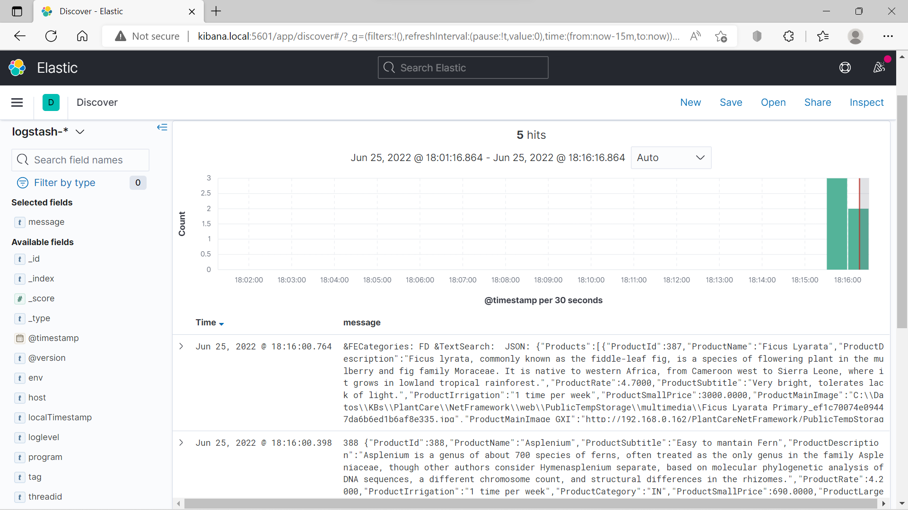

Docker compose stack (elasticsearch, logstash and kibana) ready for receive log4j and log4net logs, and analize them with Kibana.



## log4j and log4net configuration sample

### log4j appender

```xml
<Socket name="UdpAppender" host="kibana.local" port="5960" protocol="UDP">
    <PatternLayout pattern="%d{yyyy-MM-dd HH:mm:ss,SSSZZ} [%t] %-5p - ${hostName} - MYAPP.BACKOFFICE - %m%n"/>
    <encoding value="utf-8" />
</Socket>	
```

### log4net appender

```xml
   <appender name="UdpAppender" type="log4net.Appender.UdpAppender">
      <RemoteAddress value="kibana.local" />
      <RemotePort value="5960" />
      <layout type="log4net.Layout.PatternLayout">
         <conversionPattern value="%d{ISO8601}%d{zzz} [%t] %-5p - %P{log4net:HostName} - MYAPP.BACKEND - %m%n" />
      </layout>
      <encoding value="utf-8" />
   </appender>
```
## How to use
Requirements: Docker Desktop

1. Download this repository
1. In the repo folder:
    * docker-compose build
    * docker-compose up

You can find more information in this blog (spanish):
https://blog.danielmonza.com/2022/05/gestion-logs-kibana-elasticsearch-simple.html