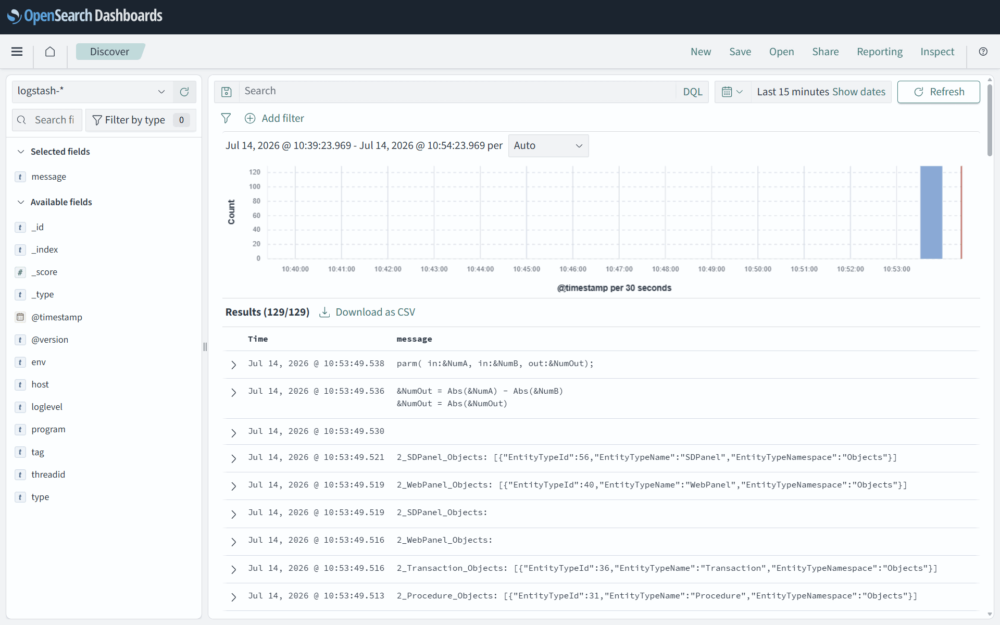

# log4opensearch

[](https://github.com/dmonza/log4opensearch/actions/workflows/ci.yml)
[](LICENSE)

A ready-to-run Docker Compose stack that receives **log4j** and **log4net** logs over UDP, parses them with **Logstash**, stores them in **OpenSearch**, and lets you explore them in **OpenSearch Dashboards**.

Point your application's UDP appender at port `5960`, run `docker compose up`, and your logs are searchable.

Java or .NET, one app or twenty: if it can write a plain-text log line to a UDP socket, it can ship
logs here. Copy-paste configs for [log4j2](#log4j2-java) and [log4net](#log4net-net) are below.

Already on **OpenTelemetry**? The stack can also ingest OTLP **traces and logs** and explore them in
the bundled Trace Analytics UI — opt-in, off by default. See [OpenTelemetry](#opentelemetry-traces--logs).

> [!WARNING]
> **This stack ships with security disabled — by design.** It is meant for local development
> and internal environments. Do not expose it to an untrusted network as-is.
> See [Security](#security) to turn authentication and TLS on.



---

## Architecture

```
  ┌──────────────┐   UDP 5960     ┌──────────────┐
  │  Your app    │───────────────>│   Logstash   │──── logstash-* ─────┐
  │ log4j/log4net│   plain text   │    (grok)    │                     │
  └──────────────┘                └──────────────┘                     │
                                                                       ▼
  ┌──────────────┐  OTLP/gRPC     ┌──────────────┐             ┌────────────┐
  │  Your app    │───────────────>│ Data Prepper │── otel-* ──>│ OpenSearch │
  │ OpenTelemetry│  4317 / 4318   │(otel profile)│            │   :9200    │
  └──────────────┘                └──────────────┘             └─────┬──────┘
       traces & logs — opt-in: docker compose --profile otel up      │
                                                              ┌───────▼─────────┐
                                                              │   Dashboards    │
                                                              │     :5601       │
                                                              └─────────────────┘
```

The OpenTelemetry path is **opt-in** — a plain `docker compose up` runs only the top row. See
[OpenTelemetry](#opentelemetry-traces--logs).

| Service        | Port         | Purpose                                         |
| -------------- | ------------ | ----------------------------------------------- |
| `logstash`     | `5960/udp`   | Log ingestion endpoint — point your appender here |
| `opensearch`   | `9200/tcp`   | Search & storage API                            |
| `dashboards`   | `5601/tcp`   | Web UI                                          |
| `provisioning` | —            | One-shot: installs index template + ISM policy, then exits |
| `provisioning-dashboards` | — | One-shot: imports the Dashboards saved objects (index pattern, dashboard), then exits |
| `data-prepper` | `4317/tcp`, `4318/tcp` | OTLP/gRPC receiver for traces & logs — **opt-in** (`--profile otel`) |

---

## Requirements

- Docker Engine 24+ with Compose v2 (Docker Desktop works out of the box)
- ~2 GB of free RAM (~3 GB with the `otel` profile — it adds one more JVM)

## Quick start

```bash
git clone https://github.com/dmonza/log4opensearch.git
cd log4opensearch
docker compose up --build
```

Then open **http://localhost:5601**.

That's it — no setup step. Versions, ports, heap sizes and retention live in
[`.env`](.env), which **is committed on purpose**: it holds defaults, not secrets.
See [Configuration](#configuration) to change them.

### Verify it works

Send a test log line and check it landed:

**Linux / macOS**

```bash
echo '2026-07-13 10:00:00,123-03:00 [1] INFO  - myhost - PROD - APP - [trace-1] [10.0.0.5] [MyProg] [42] hello world' \
  | nc -u -w1 localhost 5960
```

**Windows (PowerShell)**

```powershell
$msg = '2026-07-13 10:00:00,123-03:00 [1] INFO  - myhost - PROD - APP - [trace-1] [10.0.0.5] [MyProg] [42] hello world'
$udp = New-Object System.Net.Sockets.UdpClient
$bytes = [Text.Encoding]::UTF8.GetBytes($msg)
$udp.Send($bytes, $bytes.Length, 'localhost', 5960)
$udp.Close()
```

Then query OpenSearch:

```bash
curl -s 'localhost:9200/logstash-*/_search?pretty&size=1'
```

You should see `traceId` as `"trace-1"`.
If the document has a `_grokparsefailure_log4net` tag, your line did not match any pattern —
see [Log formats](#log-formats).

### View in Dashboards

Open **Discover** (left menu) — the `logstash-*` index pattern is **already there**, so your logs
show up immediately. Nothing to create: the stack provisions the Dashboards saved objects on
startup, the same way it installs the index template and retention policy (see
[Data management](#data-management)).

There is also a ready-made **log4opensearch overview** dashboard (left menu → **Dashboards**):
log level over time, top hosts, top programs, a parse-failure count, and a recent-messages table.

---

## Configuring your application

The stack expects **plain-text log lines over UDP** — no JSON, no serialized objects. What the
appender must produce is a line shaped like this:

```
2026-07-13 10:00:00,123-03:00 [1] INFO  - myhost - MYAPP.BACKEND - hello world
└──── timestamp + offset ────┘ └thread┘ └lvl┘   └─host─┘ └──── env/tag ────┘ └message┘
```

Both configs below emit exactly that. It is the **bare** format — the simplest of the three the
pipeline understands; the other two add trace and program fields to the same line. See
[Log formats](#log-formats) to extract more.

Two details are easy to get wrong and both are silent failures:

- **The timestamp must carry its UTC offset** (`-03:00`). Without it Logstash assumes UTC and your
  timestamps land hours off.
- **Encode as UTF-8**, or accented characters arrive mangled.

### log4j2 (Java)

Full `log4j2.xml` — drop it on the classpath (`src/main/resources/`):

```xml
<?xml version="1.0" encoding="UTF-8"?>
<Configuration status="WARN">
  <Appenders>
    <Socket name="Udp" host="localhost" port="5960" protocol="UDP">
      <PatternLayout
          pattern="%d{yyyy-MM-dd HH:mm:ss,SSSXXX} [%t] %-5p - ${hostName} - MYAPP.BACKEND - %m%n"
          charset="UTF-8"/>
    </Socket>

    <Console name="Console" target="SYSTEM_OUT">
      <PatternLayout pattern="%d{HH:mm:ss.SSS} [%t] %-5p %c{1} - %m%n"/>
    </Console>
  </Appenders>

  <Loggers>
    <Root level="info">
      <AppenderRef ref="Udp"/>
      <AppenderRef ref="Console"/>
    </Root>
  </Loggers>
</Configuration>
```

`${hostName}` is a built-in log4j2 lookup — no need to hardcode the machine name. `XXX` is what
produces the `-03:00` offset; plain `Z` would emit `-0300`, which also parses, but the examples in
this README use the colon form.

Requires `log4j-core` 2.x. This is **log4j2** — log4j 1.x has no UDP appender (its `SocketAppender`
is TCP and speaks a serialized-object protocol), so it cannot talk to this stack.

### log4net (.NET)

Full `log4net.config` (the same `<log4net>` block works inside `App.config`/`Web.config`):

```xml
<?xml version="1.0" encoding="utf-8"?>
<configuration>
  <configSections>
    <section name="log4net" type="log4net.Config.Log4NetConfigurationSectionHandler, log4net"/>
  </configSections>

  <log4net>
    <appender name="UdpAppender" type="log4net.Appender.UdpAppender">
      <RemoteAddress value="localhost"/>
      <RemotePort value="5960"/>
      <encoding value="utf-8"/>
      <layout type="log4net.Layout.PatternLayout">
        <conversionPattern
            value="%d{ISO8601}%d{zzz} [%t] %-5p - %P{log4net:HostName} - MYAPP.BACKEND - %m%n"/>
      </layout>
    </appender>

    <root>
      <level value="INFO"/>
      <appender-ref ref="UdpAppender"/>
    </root>
  </log4net>
</configuration>
```

`%d{ISO8601}` gives the date and time, `%d{zzz}` appends the offset — log4net has no single token
for both. `%P{log4net:HostName}` is a built-in global property.

On .NET (Core / 5+), point log4net at the file once at startup:

```csharp
var repo = LogManager.GetRepository(Assembly.GetEntryAssembly());
XmlConfigurator.Configure(repo, new FileInfo("log4net.config"));

var log = LogManager.GetLogger(typeof(Program));
log.Info("hello from log4net");
```

On .NET Framework, `[assembly: log4net.Config.XmlConfigurator(Watch = true)]` in `AssemblyInfo.cs`
does the same.

### Any other logger

Nothing here is log4j- or log4net-specific — the wire contract is just *one log line per UDP
datagram, UTF-8, in the layout above*. **NLog** (`Network` target, `udp://host:5960`), **Serilog**
(a UDP sink), Python's `logging`, or a bare `nc` all work, as long as the layout matches. If it does
not, the line is still indexed — just tagged `_grokparsefailure_log4net` — so nothing is lost while
you iterate on it.

Replace `localhost` with the host running the stack.

---

## Log formats

Logstash tries three grok patterns, **in this order**, and stops at the first match.
Order matters: the generic pattern would otherwise swallow the specific ones.

**1. Structured / traced** — most specific

```
2026-07-13 10:00:00,123-03:00 [1] INFO  - host - ENV - TAG - [traceId] [10.0.0.5] [ProgramName] [42] message
```
Extracts: `traceId`, `source_ip`, `program_name`, `entityId` (a `keyword`, not a number)

**2. Program + tag**

```
2026-07-13 10:00:00,123-03:00 [1] WARN  - host - ENV - ProgramName - sometag - message
```
Extracts: `program`, `tag`

**3. Bare** — most generic, keep last

```
2026-07-13 10:00:00,123-03:00 [1] DEBUG - host - ENV - message
```

Every pattern extracts `@timestamp`, `threadid`, `loglevel`, `host` and `env`.

Lines that match none of the three are **still indexed**, with the original text intact and
tagged `_grokparsefailure_log4net`. Search for that tag in Dashboards to find them.

To add a format, edit [`logstash/pipeline/logstash.conf`](logstash/pipeline/logstash.conf) —
and place your new pattern **above** any pattern more generic than it.

---

## OpenTelemetry (traces & logs)

Beyond plain-text logs, the stack can ingest **OpenTelemetry** traces and logs over **OTLP/gRPC**
and explore them in the bundled **Trace Analytics** UI — so you can open a slow request and drill
down its span waterfall to the operation that cost the time, and to the **database query** itself
when your instrumentation emits one.

This path is **opt-in** and off by default. A plain `docker compose up` is unchanged. Turn it on
with the `otel` profile:

```bash
docker compose --profile otel up --build
```

That adds one container — an OTLP receiver — and two gRPC ingress ports:

| Port | Signal | Point your exporter's… |
| --- | --- | --- |
| `4317/tcp` | traces | `OTEL_EXPORTER_OTLP_TRACES_ENDPOINT=http://<host>:4317` |
| `4318/tcp` | logs   | `OTEL_EXPORTER_OTLP_LOGS_ENDPOINT=http://<host>:4318` |

> Both ports speak **gRPC**. This stack ships **no OTLP/HTTP** endpoint, so `4318` here carries
> **logs over gRPC** — it is not the usual OTLP/HTTP port. Traces and logs are separate receivers,
> hence two endpoints; a standard OpenTelemetry SDK or agent lets you set a per-signal endpoint.

Traces land in `otel-v1-apm-span-*`, the service map in `otel-v1-apm-service-map`, logs in
`otel-logs-*` — all separate from `logstash-*`. The legacy log path and the OTLP path live in
**separate contexts** and never collide.

### Exploring traces

Open **Trace Analytics** in Dashboards (left menu → Observability → Trace Analytics): the trace list,
latency and error views, the service map, and — per trace — the **span waterfall**. Click the slowest
span to see its attributes, including the database statement when the span carries one.

**Nothing to configure for traces** — Trace Analytics reads `otel-v1-apm-span-*` and
`otel-v1-apm-service-map` by their fixed names, so traces appear as soon as they arrive; you do **not**
create an index pattern for them.

### Exploring logs

Logs do **not** show in Trace Analytics. To see them, open **Discover** — the `otel-logs-*` index
pattern (time field **`time`**, the event time; `@timestamp` is not populated on OTLP log records)
is provisioned automatically when you bring the stack up with the `otel` profile, so there is
nothing to create. Filter by `traceId` to line a log up with its trace.

### Multiple projects and apps

Everything lands in the shared OTLP indices; you separate projects and apps with the standard
OpenTelemetry **resource attributes**, set on the client:

- `service.name` — the individual app: `OTEL_SERVICE_NAME=web`.
- `service.namespace` — the **project** it belongs to: `OTEL_RESOURCE_ATTRIBUTES=service.namespace=projectA`.

Trace Analytics is built around `service.name`, so a naming convention like `projectA/web` reads cleanly
there. In Discover and dashboards, filter spans and logs by `resource.attributes.service@namespace`
(Data Prepper flattens attribute dots to `@`). This is **soft** isolation — all projects share the
indices and the single retention knob. Hard per-project isolation (separate indices, separate retention
or access) is intentionally not done: on an unauthenticated endpoint a client-controlled index name
invites index explosion, the same reason the log path keeps one shared index.

### How deep the drilldown goes

The stack renders whatever span tree your application emits. **How far you can drill is a property of
your instrumentation, not of the stack.** A database-query span carries the SQL only if your runtime
produces one:

- **JVM apps** with the OpenTelemetry Java agent auto-instrument JDBC, so you get a **span per SQL
  statement** with the query text (literal values masked as `?` by default). You drill request → SQL.
- **.NET apps** (GeneXus generator) ship the OpenTelemetry SqlClient instrumentation, so database
  access is auto-instrumented too: you get a **span per SQL statement** carrying `db.statement` — you
  drill request → SQL just like the JVM. The SQL span's display *name* is the KB name (GeneXus sets
  `db.name` to it), so the query text lives in the `db.statement` attribute, not the span label. For
  descriptive spans at the **object** level in between (the procedure / business-component names),
  enable the **Generate Observability span** property on those objects — see the GeneXus appendix.

### Metrics

Metrics (OTLP's third signal) are **not** ingested yet — they answer aggregate questions, not the
per-request drilldown this path is for. They are planned as a future opt-in on the same receiver.

### Retention

The OTLP span and log indices are governed by the **same** `LOG_RETENTION_DAYS` knob as `logstash-*`
(see [Data management](#data-management)). The cumulative **service-map index is excluded** — it is
not time-partitioned, so deleting it would erase the accumulated map rather than expire old data.

---

## Data management

Logs land in daily indices: `logstash-YYYY.MM.dd`.

Two artifacts are installed automatically on startup by the `provisioning` service:

- **[`provisioning/index-template.json`](provisioning/index-template.json)** — explicit field mappings.
- **[`provisioning/ism-policy.json`](provisioning/ism-policy.json)** — an ISM policy that
  **deletes indices older than 30 days**. Without it, disk usage grows forever.

Under the `otel` profile ([OpenTelemetry](#opentelemetry-traces--logs)), a second one-shot
(`provisioning-otel`) installs the trace and log index templates (`provisioning/otel-*-template.json`),
and the **same** ISM policy above is extended to also delete the daily `otel-v1-apm-span-*` and
`otel-logs-*` indices — one retention knob for every index. The cumulative `otel-v1-apm-service-map`
is deliberately left out, so the accumulated map is never expired.

A third one-shot (`provisioning-dashboards`) imports the **Dashboards saved objects** — the
`logstash-*` index pattern, the core visualizations, and the overview dashboard — from a committed,
versioned artifact ([`provisioning/dashboards/`](provisioning/dashboards)), so Discover and the
dashboard work with no manual "create an index pattern" step. The import waits until Dashboards is
actually ready (its `/api/status` returns healthy) and runs with `overwrite=true`, so re-running
`docker compose up` is safe — objects carry stable ids and are replaced in place, never duplicated.
Under the `otel` profile, a companion one-shot imports the `otel-logs-*` index pattern too.

**The index pattern's field list is computed at startup, not baked in.** On each `docker compose up`
the one-shot reads the live fields from the running indices, so any field your pipeline produces —
including ones you add to the grok later — is picked up automatically on the next start; no manual
"Refresh field list" click. On a first, empty start (no logs yet) it falls back to the fields
declared in the index template, so the dashboard still resolves its fields instead of erroring. If
you change the grok while the stack is already running, re-cache without a full restart:

```bash
docker compose up -d --force-recreate --no-deps provisioning-dashboards
```

To change or add visualizations, edit them in Dashboards, export the saved objects
(**Dashboards Management → Saved Objects → Export**) as NDJSON, and replace the file under
`provisioning/dashboards/` — keeping the stable ids so re-imports stay idempotent. You can drop the
exported index pattern's cached `fields` (the import recomputes it), but leaving it in is harmless.

To change retention, override `LOG_RETENTION_DAYS` on the `provisioning` service
(see [Configuration](#configuration)) and re-run `docker compose up`. The bootstrap script is
idempotent — it updates the existing policy in place.

Data persists in the `opensearch-data` volume across restarts.
To wipe everything: `docker compose down -v`.

---

## Configuration

All tunables live in **[`.env`](.env)** — image versions, published ports, JVM heap sizes and
log retention. It is tracked in git, which is a deliberate choice:

- It contains **no secrets**, only defaults for a stack that ships without authentication.
- A single source of truth. No `.env.example` to keep in sync with a gitignored twin.
- A fresh clone runs with `docker compose up`, no `cp` step.

> **Never put credentials in `.env`.** If you enable security (see below), supply the password
> through `docker-compose.override.yml` or a shell variable instead.

Three ways to override, in increasing precedence:

| How | Committed? | Use it for |
| --- | --- | --- |
| Edit `.env` | yes | changing a default for everyone |
| Shell variable | no | your machine, or a one-off run: `OPENSEARCH_PORT=19200 docker compose up` |
| `docker-compose.override.yml` | no | secrets, and structural changes `.env` cannot express |

Ports, heap, retention and image versions are all variables in `.env`, so changing any of them
needs nothing more than a shell variable — no file to edit, nothing to keep out of git.

Reach for `docker-compose.override.yml` only when `.env` cannot help: credentials (it is
committed) or structure (an extra volume, a different healthcheck). It is a standard Compose
convention, not something this project invents: create the file and Compose merges it over
`docker-compose.yml` automatically, with no `-f`. It is gitignored.

Two merge rules worth knowing, because they differ and the difference bites:
`environment` is merged **key by key** — yours wins. But `ports` is **concatenated** — yours is
*added* to the existing one, so you cannot resolve a port conflict this way. To replace a port
list instead of appending to it, tag it `ports: !override`.

---

## Version notes

Pinned in [`.env`](.env). Two things worth knowing before you bump anything:

**Logstash is stuck in the 8.x series.** The `opensearch-project` Logstash image has not been
rebuilt in a long time, so it does not track OpenSearch releases. That is fine — Logstash talks
to OpenSearch over the REST API — but it means the version numbers of the two are unrelated, and
you should not expect a Logstash `3.x` to exist.

**ECS compatibility is switched off, in two places.** Logstash 8 turns ECS mode on by default,
which turns `host` into an object (`host.hostname`, `host.ip`) instead of a string. This pipeline
uses the flat, pre-ECS layout, and the index template maps `host` as a `keyword`, so ECS mode
produces mapping conflicts and OpenSearch starts rejecting documents.

It is therefore disabled twice, on purpose:

- **Per plugin**, with `ecs_compatibility => "disabled"` on the input, its codec, the grok filter
  and the output, in [`logstash/pipeline/logstash.conf`](logstash/pipeline/logstash.conf). This is
  what actually holds the schema flat.
- **Pipeline-wide**, with `PIPELINE_ECS_COMPATIBILITY=disabled` on the `logstash` service in
  [`docker-compose.yml`](docker-compose.yml), which the image's entrypoint maps into
  `logstash.yml`. This one is the safety net: a plugin added later without its own
  `ecs_compatibility` setting cannot silently start emitting ECS fields into the same index.

Note that this flag only governs the fields the *plugins* generate. The fields grok extracts
(`traceId`, `entityId`, `env`, …) are named by the pattern, and ECS mode does not touch them.

Relatedly, the pipeline sets `manage_template => false`: the index template is ours, installed by
the `provisioning` service, so the output plugin has no business pushing its own.

---

## Security

**The default setup has no authentication and no TLS.** The OpenSearch security plugin is
disabled (`DISABLE_SECURITY_PLUGIN=true`), the Dashboards security plugin is removed from the
image, and the UDP ingestion port accepts anything sent to it. This is a deliberate
*dev-first* trade-off: zero friction to get running.

What that means in practice:

- Anyone who can reach port `9200` can read and delete all your logs.
- Anyone who can reach port `5960/udp` can inject arbitrary log entries.
- Under the `otel` profile, anyone who can reach `4317/tcp` or `4318/tcp` can inject arbitrary
  OpenTelemetry traces and logs — those OTLP endpoints are unauthenticated and plaintext too.
- Everything travels in plaintext.

**Only run this on `localhost` or a trusted internal network.**

### Enabling security

To run with the security plugin on:

1. **`docker-compose.yml`** — on the `opensearch` service, remove `DISABLE_SECURITY_PLUGIN`
   and `DISABLE_INSTALL_DEMO_CONFIG`, and set an admin password:
   ```yaml
   - OPENSEARCH_INITIAL_ADMIN_PASSWORD=${OPENSEARCH_ADMIN_PASSWORD}
   ```
   Supply the value from a shell variable, or from a `docker-compose.override.yml` — **never**
   from `.env`, which is committed (CI fails the build if it finds a credential in there):
   ```yaml
   # docker-compose.override.yml — gitignored, create it yourself
   services:
     opensearch:
       environment:
         - OPENSEARCH_INITIAL_ADMIN_PASSWORD=your-password
   ```
   Switch the healthcheck and all `OPENSEARCH_URL` / `OPENSEARCH_HOSTS` values to `https://`.

2. **The Dashboards security plugin is disabled twice** — undo both, or it stays off:
   delete the `RUN ... plugin remove securityDashboards` line in
   `opensearch_dashboards/Dockerfile`, and drop `DISABLE_SECURITY_DASHBOARDS_PLUGIN=true`
   from the `dashboards` service in `docker-compose.yml`.

3. **`opensearch_dashboards/opensearch_dashboards.yml`** — add:
   ```yaml
   opensearch.username: kibanaserver
   opensearch.password: <your-password>
   opensearch.requestHeadersWhitelist: [authorization, securitytenant]
   opensearch_security.multitenancy.enabled: false
   opensearch_security.cookie.secure: false   # true if you serve Dashboards over HTTPS
   ```

4. **`logstash/pipeline/logstash.conf`** — uncomment the `user`, `password` and `ssl` options
   in the `output` block and supply them via environment variables.

5. **`provisioning/import-dashboards.py`** — the saved-objects import is unauthenticated by
   default. Set `DASHBOARDS_USER` / `DASHBOARDS_PASSWORD` on the `provisioning-dashboards`
   service (the script adds basic auth when they are present) and switch `DASHBOARDS_URL` to
   `https://` (supply the credentials via `docker-compose.override.yml` or a shell variable,
   never `.env`).

6. Provide **real certificates**. Do not reuse the OpenSearch demo certificates outside of a
   throwaway environment — their private keys are published and known to everyone.

For the full picture, see the
[OpenSearch security documentation](https://docs.opensearch.org/latest/security/).

---

## Troubleshooting

**Nothing shows up in Dashboards.**
Check that Logstash is actually receiving traffic: `docker compose logs -f logstash`.
UDP is fire-and-forget — if the port is wrong or blocked, the sender gets no error.

**Logs arrive but every field is `_grokparsefailure_log4net`.**
Your appender layout does not match any of the three patterns. Compare your output against
[Log formats](#log-formats), paying attention to the timestamp format and the ` - ` separators.

**OpenSearch container exits immediately.**
Almost always `max_map_count` on Linux/WSL:
```bash
sudo sysctl -w vm.max_map_count=262144
```

**Timestamps are off by a few hours.**
Make sure your layout emits the timezone offset (`%d{ISO8601}%d{zzz}` in log4net,
`ZZ` in log4j). Without it, Logstash assumes UTC.

**Port already in use.**
Republish on another host port with the variables from `.env` — no file needs editing:
```bash
OPENSEARCH_PORT=19200 DASHBOARDS_PORT=15601 LOG_UDP_PORT=15960 docker compose up
```
Do *not* try to fix this by adding a `ports:` entry in `docker-compose.override.yml`: Compose
concatenates port lists, so the conflicting binding would still be there. See
[Configuration](#configuration).

---

## Appendix: GeneXus

Nothing in this stack is GeneXus-specific — it grew out of a GeneXus deployment, so the
[`genexus/`](genexus) folder ships the glue for it. Ignore this section if you are not a
GeneXus user.

GeneXus applications log through log4net, so they need no special support here: the
[log4net setup](#log4net-net) above applies as-is. These files just save you the typing.

| File                 | What it is                                                          |
| -------------------- | ------------------------------------------------------------------- |
| `log.config`         | log4net config sending `GeneXusUserLog` output to this stack via UDP |
| `log.console.config` | Same, but writing to the console — useful while developing           |
| `sincrumlogs.xpz`    | GeneXus export with helper objects for structured logging            |

Drop `log.config` into your GeneXus model's deployment directory and set `RemoteAddress` to the
host running the stack.

### GeneXus with OpenTelemetry

GeneXus apps can emit **OpenTelemetry** traces and logs instead of (or alongside) log4net. Enable it
in the generator — set the **Observability Provider** property to **OpenTelemetry** — start the stack
with the `otel` profile (see [OpenTelemetry](#opentelemetry-traces--logs)), and point the exporter at
it with the standard environment variables:

```bash
OTEL_EXPORTER_OTLP_TRACES_ENDPOINT=http://<host>:4317
OTEL_EXPORTER_OTLP_LOGS_ENDPOINT=http://<host>:4318
OTEL_EXPORTER_OTLP_PROTOCOL=grpc
OTEL_SERVICE_NAME=my-genexus-app
# Group several GeneXus apps under one project (soft multi-project isolation):
OTEL_RESOURCE_ATTRIBUTES=service.namespace=my-project
```

> [!WARNING]
> **Enabling OpenTelemetry replaces log4net in .NET.** When the Observability Provider is set to
> anything other than *None*, the GeneXus .NET generator stops using log4net: that app no longer feeds
> the UDP/log path — it feeds OTLP instead. Coexistence is therefore **per application**: one app ships
> log4net *or* OpenTelemetry, not both. Across a fleet, some apps can use each, and this stack accepts
> both at once. (The Java generator keeps log4j2 and can additionally correlate logs by `trace_id`.)

**Traces per generator — this decides how deep you can drill:**

- **Java** — instrumentation is **automatic** via the OpenTelemetry Java agent
  (`-javaagent:opentelemetry-javaagent.jar`, packaged in the GeneXus Java deployment). Database access
  is auto-instrumented, so you get a **span per SQL statement** with the query text — you drill a slow
  request all the way to the query. The statement is **sanitized by default** (literals shown as `?`);
  to capture literal values set `OTEL_INSTRUMENTATION_COMMON_DB_STATEMENT_SANITIZER_ENABLED=false` on
  the app, accepting the privacy trade-off.
- **.NET** — enable the **Generate Observability span** property on the objects you want traced
  (Procedures, Data Providers, Business Components). These are **object-level** spans: you drill to the
  procedure or data-provider, **not** the individual SQL. GeneXus emits no per-SQL span for .NET today;
  adding the OpenTelemetry .NET auto-instrumentation for the database client is an (unsupported,
  untested-here) way to obtain one.

---

## Contributing

Bug reports and pull requests are welcome. See [CONTRIBUTING.md](CONTRIBUTING.md).

## License

[MIT](LICENSE) © Daniel Monza

Background reading (Spanish): [Gestión de logs con OpenSearch](https://blog.danielmonza.com/2022/05/gestion-logs-kibana-elasticsearch-simple.html)
